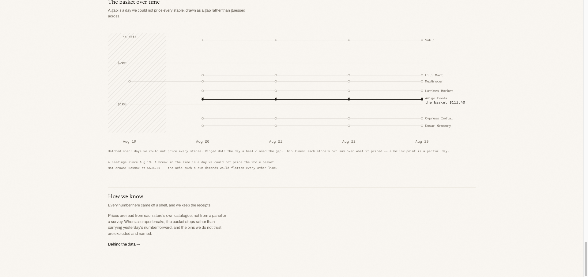
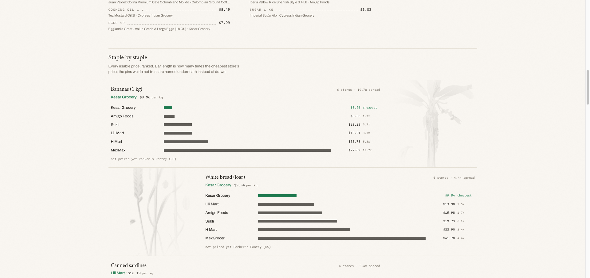
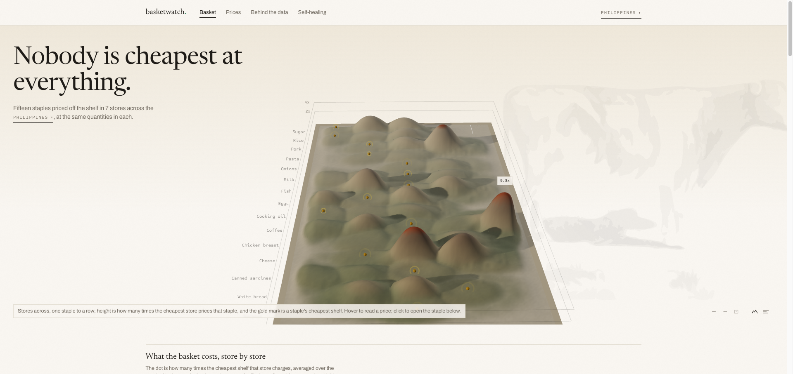
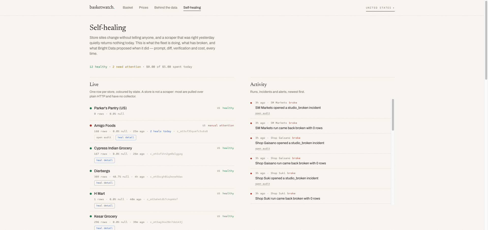
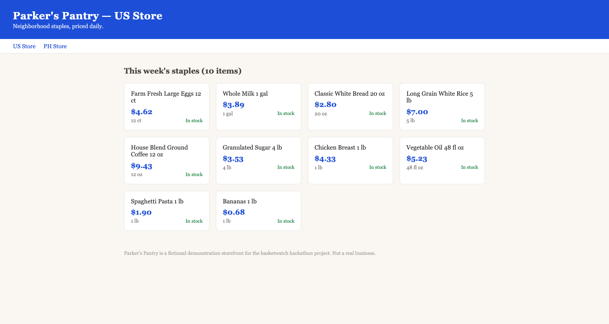
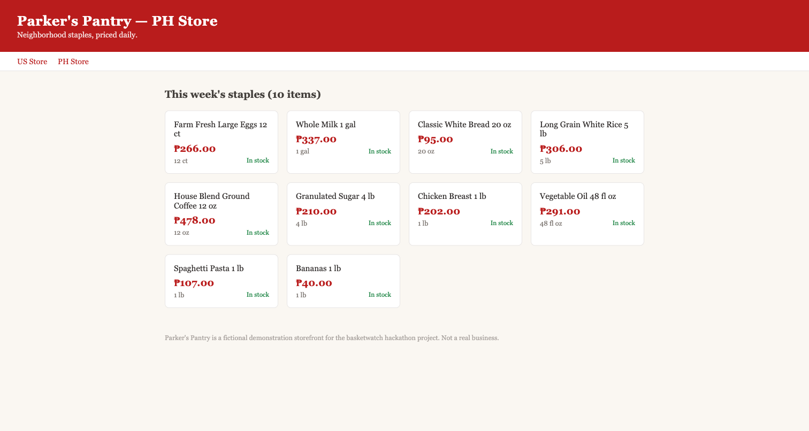
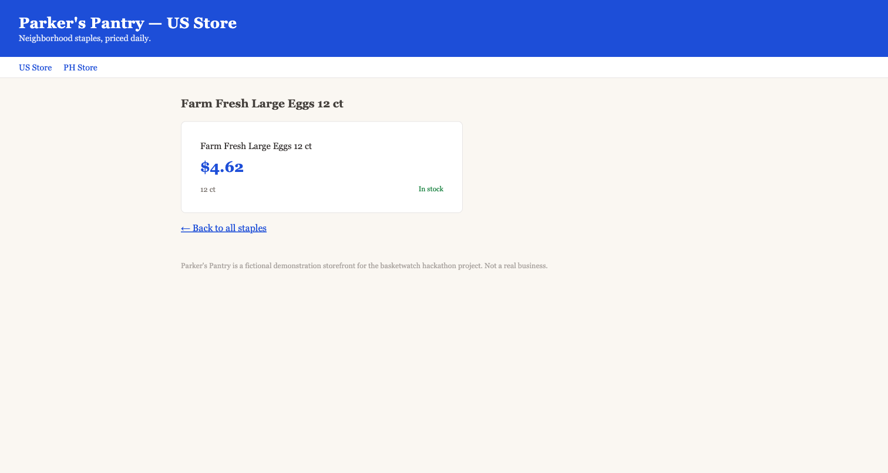

# basketwatch

A grocery basket index whose promise is that it shows its own gaps. Prices come
from a fleet of scrapers; when one breaks, the index line stops rather than
interpolating over the missing days, and a heal loop repairs the scraper with
the whole attempt audited.

Built for the Bright Data x WeMakeDevs
[Into the Scrape-Verse](https://www.wemakedevs.org/hackathons/scrape-verse)
hackathon. NestJS, Next.js, Postgres, Bright Data Scraper Studio.

- **Live demo:** [basketwatch.spencerjireh.com](https://basketwatch.spencerjireh.com) — no login, no signup
- **Demo video:** `TODO: paste YouTube link before submitting`
- **Parker's Pantry** (our disclosed test store): [US](https://pantry.spencerjireh.com/us) · [PH](https://pantry.spencerjireh.com/ph)

## What you are looking at



The front page draws a price terrain from live shelf data: rows are 15 staples
(rice, eggs, chicken, and so on), columns are stores with the cheapest basket
on the left, and height is each store's price as a multiple of the cheapest
shelf for that staple. Hovering any point shows the receipt: the product, the
price, and when it was scraped. One click switches the whole page between the
United States and the Philippines.



Each staple has a listing page with every store's price side by side, a
cheapest-cart summary (the winning store per staple and the basket total if
you buy each line at its winner), and the basket cost over time. Days where a
price could not be collected render as gaps and hatched spans; missing data is
never interpolated. The **Behind the data** page shows where every number came
from and flags the prices we do not fully trust, including ones still feeding
the front page. The **Prices** page is a raw search over the full catalogue of
roughly 19,000 products.

## The fleet

Sixteen real stores are registered across the United States and the
Philippines, plus the two disclosed Parker's Pantry clones. In the 24 hours
before this snapshot, 13 of the 16 returned fresh rows; the three that
returned nothing have open incidents, visible on the
[Self-healing](https://basketwatch.spencerjireh.com/healing) page rather than
hidden.

Snapshot of `GET /api/fleet` on 2026-08-23 (UTC). The `c_*` values are the
live Bright Data Scraper Studio collector IDs.

| Store | Country | Studio collector | In the index | Last pull (rows) |
| --- | --- | --- | --- | --- |
| Ever Supermarket | PH | HTTP pull | yes | Aug 23 (6,962) |
| Shop Gaisano | PH | HTTP pull | yes | Aug 23 (65) |
| Shop Suki | PH | `c_mt5q0jzi18h73rtbha` | yes | Aug 23 (291) |
| SM Markets | PH | `c_mt5adrno248hml4trg` | yes | Aug 23 (0 — incident open) |
| Landers Superstore | PH | `c_mt5bbos7onya4mufc` | yes | Aug 23 (0 — incident open) |
| MerryMart Wholesale | PH | `c_mt5afb93oof2430yg` | yes | Aug 23 (0 — incident open) |
| Amigo Foods | US | `c_mt5sf35quefc5u6s8` | yes | Aug 23 (168) |
| Cypress Indian Grocery | US | `c_mt5sf1hn2gm0alggzg` | yes | Aug 23 (167) |
| Dierbergs | US | `c_mt5bcgh01q3exw9das` | no | Aug 23 (389) |
| H Mart | US | `c_mt5ahmtdb7c4qmkkf` | no | Aug 23 (1) |
| Kesar Grocery | US | `c_mt5ag34x28n7do143j` | yes | Aug 23 (296) |
| Latimex Market | US | `c_mt5sf4te2nl1om58n6` | yes | Aug 23 (92) |
| Lili Mart | US | `c_mt5si8vp2cd0f03mfp` | yes | Aug 23 (122) |
| MexGrocer | US | `c_mt5siakh3td7a3dk1` | yes | Aug 23 (95) |
| MexMax | US | HTTP pull | yes | Aug 23 (142) |
| Sukli | US | HTTP pull | yes | Aug 23 (1,946) |
| Parker's Pantry (US) | US | HTTP pull | never (disclosed clone) | on demand |
| Parker's Pantry (PH) | PH | HTTP pull | never (disclosed clone) | on demand |



## How Bright Data Scraper Studio runs this

Scraper Studio is the collection layer, not an add-on:

- **Twelve stores run as Studio collectors** (the `c_*` IDs above). Four
  Shopify-style sites expose a machine-readable catalogue and are pulled over
  plain HTTP instead. Requests route through Web Unlocker for the sites that
  block scraping.
- **Collectors parse product pages, not listings.** A staple filter selects
  which product URLs to fetch, which cuts each pull 10-20x, so a full-store
  pull costs cents in credits.
- **The heal loop repairs collectors through Studio.** When a store changes
  its layout, the loop sends the broken page to Studio's refactor API, which
  rewrites the collector's extraction recipe in place. Studio is the mechanism
  of self-healing, not only of ingestion.
- **The fleet is reproducible.** [`docs/collector-manifest.json`](docs/collector-manifest.json)
  registers every store and the exact seed URL and instruction used to create
  its collector; [`docs/collector-runbook.md`](docs/collector-runbook.md) is
  the step-by-step procedure to rebuild the fleet on any Bright Data account.

## The self-healing loop, demonstrated



Parker's Pantry is a fictional grocery store we host ourselves, so the heal
loop has a target we are allowed to break. To demonstrate the loop end to end,
we flipped its storefront to an alternate layout:

1. The next pull returned zero rows and the system opened an incident.
2. The heal loop fetched the broken page and asked Studio to refactor the
   collector. The redesign had split the price into two elements; the new
   recipe stitched it back together.
3. The fix was verified against a canary pull — ten rows, zero nulls — and
   the incident closed. No human intervened. Total cost: a few cents.

Every step of the attempt is audited in the dashboard: the evidence, the
generated recipe, the canary result, and the cost.

Full disclosure, because a price tracker must not launder fake data: Parker's
Pantry prices are generated (a deterministic seeded walk of at most 1.5% per
day per product), both storefronts are labeled as fake, and they ship with
`index_contributor = false`, so they render on the dashboard but never move
the country index.

<p>



</p>

---

# Development

## Layout

```
apps/api        NestJS + Drizzle + pg-boss. Owns every read and write, incl. SSE.
apps/web        Next.js dashboard. A pure client of the API; never touches Postgres.
apps/pantry     Parker's Pantry, the disclosed clone store (see below).
packages/contract   zod schemas and types. The only thing the two apps share.
packages/tsconfig   base / library / nest / next compiler configs.
packages/eslint-config  base / nest / next lint configs, incl. the import boundaries.
docs/           design docs, the deploy runbook, the API contract.
lab/            frozen exploration notebooks and the Bright Data credit guard.
                Not product code; nothing under apps/ or packages/ imports it.
```

Inside `apps/api/src`, `modules/` holds one directory per domain: `pullers`
(Studio-only data pipeline), `heal` (self-healing orchestrator with
auto-approve), `validator` (baseline checks and incident opening), `fleet`
(provisioning and scraper state). The notifier module is scaffolded but not
yet wired to a delivery channel.

## Commands

`just` is the entry point; run `just` on its own to list every recipe. Use
`just dev` rather than an app's own dev script: the API depends on the contract
package's watch build, and starting an app directly means contract edits stop
propagating.

```sh
pnpm install
just up             # local postgres
just dev            # contract watch + api :3001 + dashboard :3000
just check          # typecheck, lint, test, build
```

## Database

**`DATABASE_URL` in the repo-root `.env` points at the LOCAL database.** The
deployed one lives in `.env.prod`, which nothing loads by default — `just
db-backup` reads it, and otherwise you name it yourself. `drizzle.config.ts`
still refuses any non-local host unless you opt in explicitly, which is the
second lock on the same door:

```sh
# local dev -- the recipe passes the local URL for you
just db-migrate

# deployed, on purpose
ALLOW_REMOTE_DB=1 pnpm db:check
```

`apps/api/src/database/schema.ts` and `apps/api/drizzle/` were carried over
verbatim from the previous app, because they describe a live database holding
real data. Migration `0000` must keep its exact bytes: drizzle decides what to
apply from the journal's `when` timestamp, and re-running `0000` against
production fails on `CREATE VIEW "latest_price"`, which is the one statement in
that file without an `IF NOT EXISTS` guard.

## Parker's Pantry, the disclosed test rig

`apps/pantry` is a fictional grocery store we run ourselves at
`pantry.spencerjireh.com`, with a US storefront (`/us`, USD) and a PH twin
(`/ph`, PHP). It exists so the break-detect-heal loop has a target we can
break on purpose, and so the comparison view keeps one source per country
that cannot go down with a third-party site.

Full disclosure, because a price tracker must not launder fake data:

- Its prices are **generated**: a deterministic seeded walk of at most 1.5%
  per day per product from fixed base prices. Same day, same price; no
  storage involved.
- Both stores ship with `index_contributor = false`, so they render on the
  dashboard (marked as not counted) but never move the country index. Letting
  one in is a deliberate ops action:
  `POST /api/fleet/:storeId/index-contributor` (ops token), or
  `just index-contributor clone-parkers-pantry-ph true`.
- The break switch swaps the storefront markup between two layouts:
  `just pantry-layout us b` breaks the US scraper's assumptions, `a` restores
  them. Guarded by `PANTRY_ADMIN_TOKEN`.

## Things that will bite you

- **Do not run the API under `tsx`.** esbuild does not implement
  `emitDecoratorMetadata`, so NestJS injection silently hands every provider
  `undefined`. `pnpm dev` uses the real compiler for exactly this reason.
- **Do not enable `@typescript-eslint/consistent-type-imports` for the API.** Its
  autofix rewrites injected classes to `import type` and breaks DI the same way.
- **`API_INTERNAL_URL` is a build-time value for the dashboard image.** Next
  bakes `rewrites()` into the routes manifest during `next build`, so it is a
  Docker build arg, not a runtime env var.
- **Container healthchecks must use `127.0.0.1`, not `localhost`.** In the
  container `localhost` resolves to `::1` first and the server binds IPv4.
- `typescript` is pinned exactly. The latest major drops the decorator metadata
  emit that NestJS needs.

## The API seam

Nest sets a global `api` prefix with no exclusions, and the dashboard rewrites
`/api/:path*` straight through without stripping anything. The path is identical
everywhere:

| Where                  | URL                                       |
| ---------------------- | ----------------------------------------- |
| dev, direct            | `localhost:3001/api/health`               |
| dev, via the dashboard | `localhost:3000/api/health`               |
| prod, inside compose   | `api:3001/api/health`                     |
| prod, public           | `basketwatch.spencerjireh.com/api/health` |
