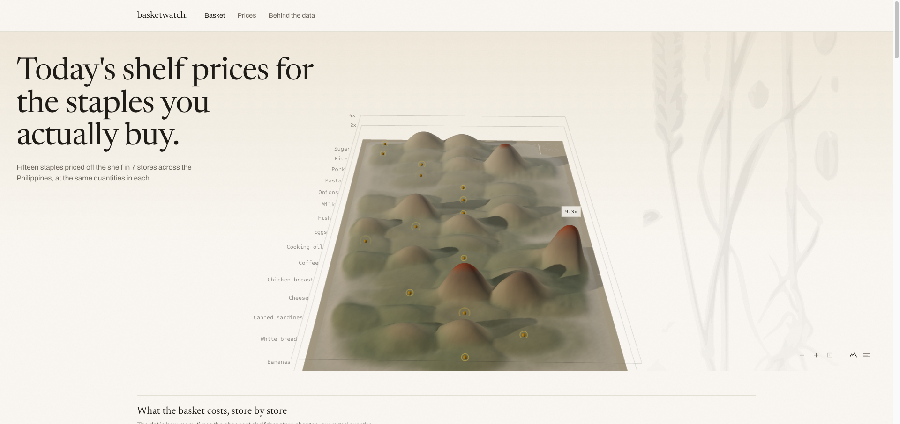

# basketwatch

A grocery basket index for the Philippines. It reads shelf prices straight
from supermarket catalogues, prices the same fifteen staples in every store at
the same quantities, and shows what the basket costs today and how it moved.
When a store's site changes and the pull stops making sense, the index shows a
gap for that day rather than a guess: a missing price is never interpolated.

Built with NestJS, Next.js, and Postgres.

- **Live:** [basketwatch.spencerjireh.com](https://basketwatch.spencerjireh.com) — no login, no signup
- **Docs:** [architecture](docs/architecture.md) · [API contract](docs/api-contract.md)

## What you are looking at



The front page draws a price terrain from live shelf data: rows are fifteen
staples, columns are stores with the cheapest basket on the left, and height
is each store's price as a multiple of the cheapest shelf for that staple.
Hovering a point shows the product, the price, and when it was scraped. Below
the terrain, each staple gets every store's price side by side. **Behind the
data** shows where each number came from and which prices we do not fully
trust, and **Prices** is a raw search over the stores' catalogues, about
27,000 products.

## This week

`/this-week` shows prices that come from government bulletins rather than store
catalogues, for Metro Manila:

- Fuel: DOE's weekly pump prices per city and brand, and the Tuesday adjustment
- LPG: DOE's monthly 11-kg cylinder range
- Wet markets: DA's daily Bantay Presyo prices per public market
- Suggested retail prices: DTI's current bulletin for basic goods

## The stores

| Store               | Status    | In the index      |
| ------------------- | --------- | ----------------- |
| Ever Supermarket    | collected | yes               |
| Shop Gaisano        | collected | yes               |
| Shop Suki           | collected | yes               |
| SM Markets          | collected | yes               |
| Landers Superstore  | parked    | yes, from history |
| MerryMart Wholesale | parked    | yes, from history |

A parked store keeps its price history and its place in the index; it gets no
new observations until collection for it resumes. US stores from the
project's first weeks are still in the database with `active = false`: their
history is kept, nothing reads it.

## Where the prices come from

Prices are collected by a separate private service, which writes them into
the same Postgres database this repo reads. This repo is the index and the
dashboard: the API is read-only.

Collection is change-only: an observation is stored when a price is new or
moves, and every run records how many rows the store returned. Each run is
checked against the store's recent history, and a run that does not make
sense opens an incident instead of changing the index. Days with an open
incident on an index store render as hatched gaps on the chart, labelled with
the incident.

---

# Development

## Layout

```
apps/api        NestJS + Drizzle. Every read the dashboard makes, incl. SSE. Read-only.
apps/web        Next.js dashboard. A pure client of the API; never touches Postgres.
packages/       contract (the zod schemas both apps share), tsconfig, eslint-config.
docs/           architecture, API contract, brand assets.
```

`apps/api/src/modules/` holds one directory per domain: `basket` (the index,
the rails, the cheapest cart), `fleet` (store state), `products` (catalogue
search), `feed` and `incidents` (what happened to the data).

## Commands

`just` is the entry point; run `just` on its own to list every recipe. Use
`just dev` rather than an app's own dev script: the API depends on the
contract package's watch build.

```sh
pnpm install
just up             # local postgres
just dev            # contract watch + api :3001 + dashboard :3000
just check          # typecheck, lint, test, build
```

## Database

**`DATABASE_URL` in the repo-root `.env` points at the LOCAL database.** The
deployed one is firewalled to the collector's host; `just db-backup` dumps it
over SSH, and `drizzle.config.ts` refuses a non-local host unless you pass
`ALLOW_REMOTE_DB=1`.

The API applies migrations on boot. `0000_baseline` is the whole schema as of
September 2026, stamped with the timestamp of the last migration it replaced,
so a database that already ran the old chain skips it: drizzle decides what to
apply from the journal's `when` values, never file contents. New migrations
get a later `when`. The migrations create no rows; a useful local database is
a restored dump (`just db-restore-local`).

In production the API reads on `bw_api`, a role with `SELECT` only, and
migrates on the owner role through `MIGRATION_DATABASE_URL`.

## The API seam

Nest sets a global `api` prefix and the dashboard rewrites `/api/:path*`
straight through without stripping, so the path is identical from browser to
container: `/api/health` answers the same at `localhost:3000`,
`localhost:3001`, and `basketwatch.spencerjireh.com`.
