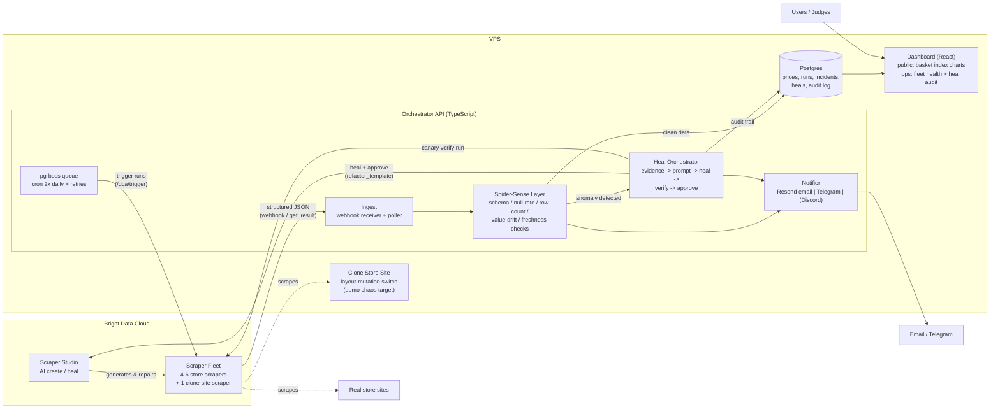
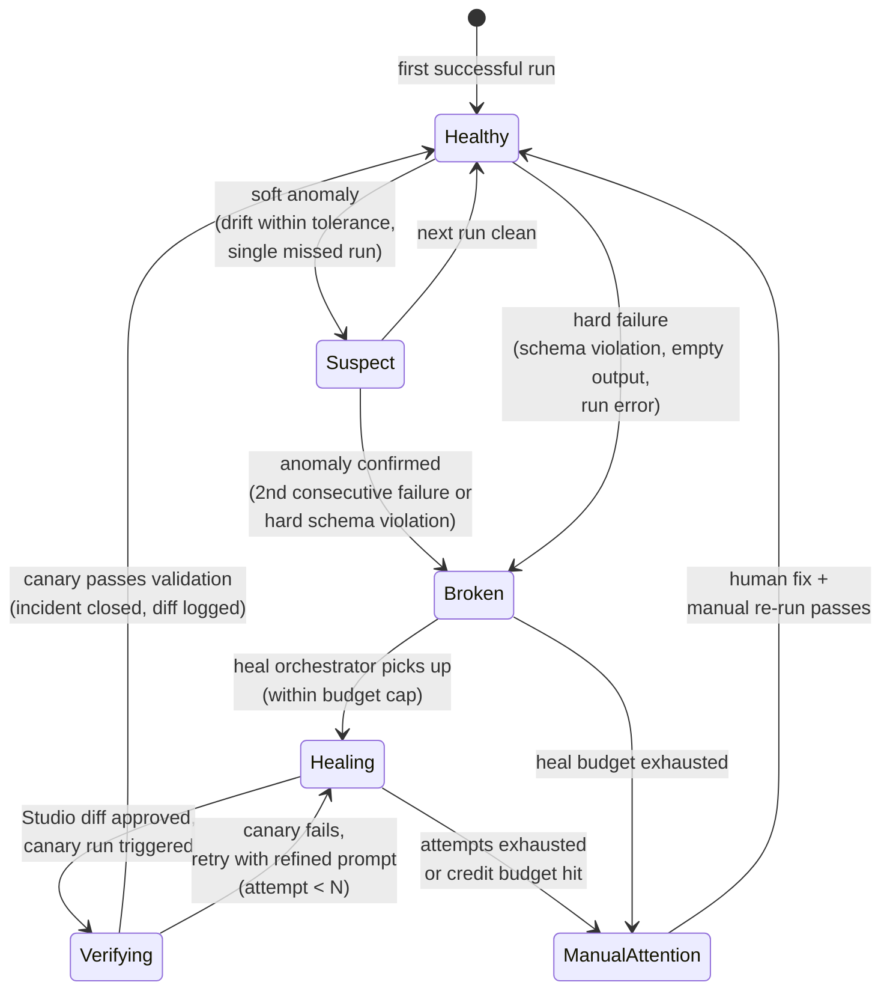
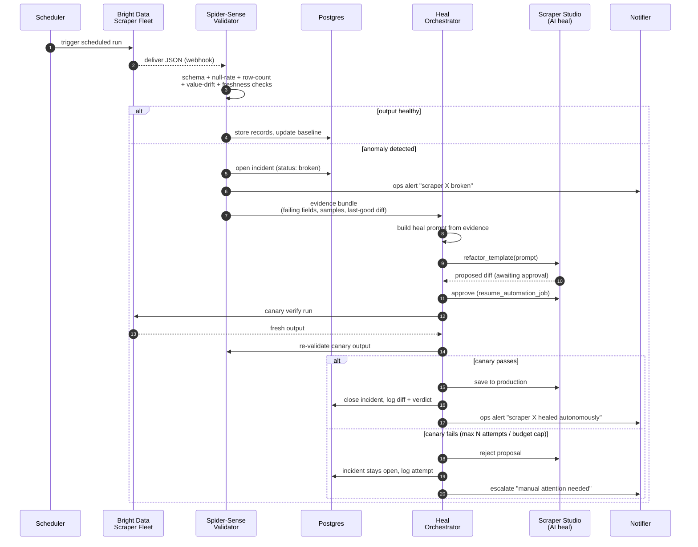
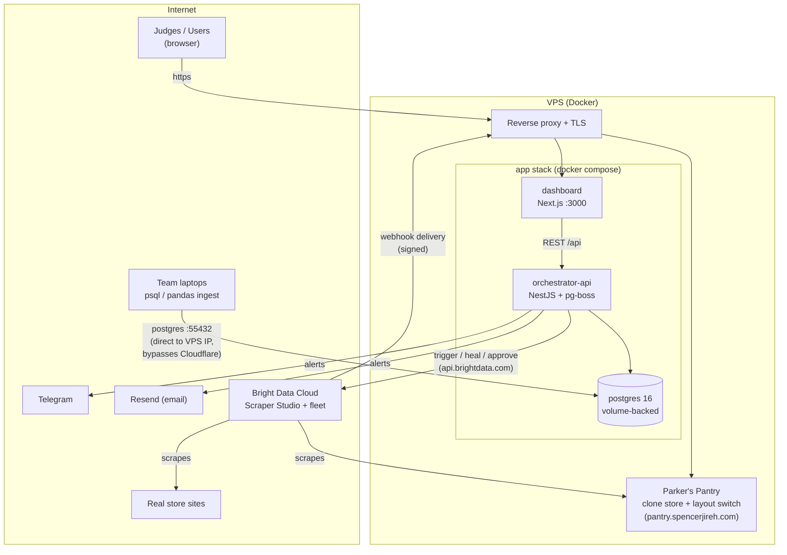

# HLD: Self-Healing Price Tracker ("Into the Scrape-Verse" 2026)

Status: draft v1 for team review, Aug 15, 2026, amended Aug 20 and Aug 23
where the build diverged from it. The shape held; four things changed in the
detail:

- **The dashboard is Next.js**, not a Vite SPA, and nginx is gone with it
  (section 3.4 and 3.6).
- **PH is in scope** — the gate passed Aug 19 (section 2).
- **The app is the repo root**, on pnpm + Turborepo. Parker's Pantry
  (`apps/pantry`) is live at `pantry.spencerjireh.com` as the disclosed clone
  store for staged break-and-heal demos.
- **Heal prompts are built deterministically.** The plan below sketched an
  LLM step composing heal prompts from evidence; what shipped is a pure
  template (`modules/heal/prompt.ts`) that turns validator findings and raw
  output diagnosis into the prompt sent to Studio's refactor API. No
  Anthropic call exists in the codebase.

Companion: [api-contract](api-contract.md) (endpoint and response shapes).

## 1. One-liner

A US/global grocery/staples price tracker whose scraper fleet cannot silently
die: a "spider-sense" layer detects breakage from output anomalies, an AI heal
orchestrator repairs scrapers autonomously through Bright Data Scraper Studio,
and every repair is verified and audited. Framing (product-first vs
devtool-first) deliberately deferred to demo prep.

## 2. Goals / non-goals

Goals
- Fleet of 4-6 Studio scrapers over structurally different store sites, plus
  one self-hosted clone store used as a controlled chaos target.
- Autonomous detect -> diagnose -> heal -> verify -> approve loop with a
  complete audit trail (evidence, prompt, diff, verdict, credits).
- Public dashboard: basket index over time, per-store/per-product prices,
  fleet health board, heal audit timeline.
- Alerts: price drops (product) and breakage/heal events (ops) via Resend
  email + Telegram; Discord if time allows.
- Deployed live on a VPS; judges click a URL.

Non-goals (explicitly out)
- User accounts / auth of any kind.
- ~~Philippines site coverage.~~ **Superseded.** The PRD (Aug 18) made country
  a first-class dimension rather than a feature, and the PH gate passed on
  Aug 19 with nine fleet-ready sites. PH is in scope.
- Human approval gates in the heal loop (auto-approve with audit instead).
- Scraping anything login-walled, paywalled, or private (hackathon rule).

## 3. Component overview

### 3.1 Scraper fleet (Bright Data Scraper Studio)
- One scraper per target site, AI-generated via `automate_template`, saved to
  production. Uniform output contract per scraper:
  `[{ product_key, name, price, currency, unit, in_stock, url, observed_at }]`.
- Delivery: webhook to our ingest endpoint (validated by shared secret);
  fallback: poll `/dca/get_result`.
- Canary runs: same scraper, `--sync`/trigger_immediate against 1 URL, used
  only for verification after heals.
- Studio exposes browser **functions** — click, navigate, wait, input — over a
  cloud browser, so a scraper can drive interaction before extracting. This is
  the lever for store-or-ZIP gating, which is the most likely reason a grocery
  candidate fails vetting. Reach for it before dropping a site.

### 3.2 Orchestrator API (NestJS)
Single NestJS service, modular internals (controllers + injectable
services). Why TS: Studio scraper code is JS, one language across
scrapers/backend/frontend serves the clean-code track. Team-confirmed
Aug 18 (replaces the earlier Hono sketch).

- **Jobs**: pg-boss — a Postgres-backed queue (no Redis broker): persistent
  jobs, retries with backoff, cron schedules. Queues: `fleet-scrape`
  (2x daily + manual trigger from ops UI, jitter between scrapers) and
  `heal` (enqueued when an incident opens).
- **Ingest**: webhook receiver; verifies signature, stores raw run, enqueues
  validation.
- **Spider-Sense validator** (pure functions, unit-tested — this is the
  technical heart):
  1. JSON Schema validation (hard fail)
  2. Row-count anomaly vs baseline expected count (hard fail if < 40%)
  3. Field null-rate spike vs rolling baseline (e.g. price null-rate jumps
     from 2% to 60%)
  4. Value drift: per-field p5/p95 envelope; flag runs where >50% of prices
     fall outside, or store-level median jumps >30% run-over-run
  5. Freshness: expected delivery missed by >2h
  - Soft anomaly -> `suspect` (stored, flagged, excluded from baselines);
    confirmed/hard -> `broken` + incident:

- **Heal orchestrator**:
  - Builds evidence bundle: failing checks, sample bad output, last-good
    sample, field-level diff summary.
  - A deterministic prompt builder (`modules/heal/prompt.ts`) turns evidence
    into a plain-language heal prompt (Studio's docs recommend small, specific
    prompts — one field at a time).
  - Calls `refactor_template`, polls; on `awaiting_approval` calls
    `resume_automation_job` (approve) -> canary run -> re-validate.
  - Pass: save to production, close incident, ops alert "healed".
  - Fail: reject, retry with refined prompt (max 3 attempts), then escalate
    to `manual_attention`.
  - **Budget guard**: per-scraper daily heal cap
    (`HEAL_MAX_PER_SCRAPER_PER_DAY`) and per-incident attempt cap
    (`HEAL_MAX_ATTEMPTS_PER_INCIDENT`). The production Studio path does not
    use the CLI guard wrappers.

  The full loop:

- **Notifier**: one interface, three adapters (Resend, Telegram, Discord).
  Product alerts (price drop >X% on basket item) and ops alerts (breakage,
  healed, escalation).

### 3.3 Datastore (Postgres 16)
Tables: `scrapers`, `runs`, `baselines`,
`price_records`, `products`, `incidents`, `heal_attempts`, `alerts`.

```mermaid
erDiagram
    SCRAPER ||--o{ RUN : "executes"
    SCRAPER ||--o{ INCIDENT : "suffers"
    SCRAPER ||--|| BASELINE : "has rolling"
    RUN ||--o{ PRICE_RECORD : "produces"
    INCIDENT ||--o{ HEAL_ATTEMPT : "triggers"
    PRICE_RECORD }o--|| PRODUCT : "prices"
    PRODUCT }o--o{ BASKET : "belongs to"
    INCIDENT ||--o{ ALERT : "emits"
    PRICE_RECORD ||--o{ ALERT : "price-drop emits"

    SCRAPER {
        text id PK "collector_id from Studio"
        text name
        text target_site
        text output_schema "JSON Schema"
        text status "healthy|suspect|broken|healing|verifying|manual"
        int heal_budget_daily
    }
    RUN {
        uuid id PK
        text scraper_id FK
        text trigger "cron|manual|canary"
        text status "ok|anomalous|error"
        jsonb raw_output
        timestamptz finished_at
    }
    INCIDENT {
        uuid id PK
        text scraper_id FK
        text kind "schema|nulls|rowcount|drift|freshness|error"
        jsonb evidence
        text state "open|healing|resolved|manual"
    }
    HEAL_ATTEMPT {
        uuid id PK
        uuid incident_id FK
        text heal_prompt
        text studio_diff
        text verdict "approved|rejected|failed"
        int credits_spent
    }
    PRICE_RECORD {
        uuid id PK
        uuid run_id FK
        uuid product_id FK
        text store
        numeric price
        text currency
        timestamptz observed_at
    }
```

Drizzle ORM + migrations. Raw run payloads kept (jsonb) so incidents can be
replayed/re-validated during development.

### 3.4 Dashboard (Next.js App Router + Tailwind)
- **Public**: basket index line (the hero chart — gaps visualize breakage,
  heals close the line), per-product store comparison, price-drop feed.
- **Ops ("web" view)**: fleet health board (state machine per scraper),
  incident timeline, heal audit viewer showing evidence -> prompt -> Studio
  diff -> verdict, credit spend meter.
- Server components fetch on first paint; only the live feed and fleet board
  open an EventSource. No component library: the primitives are hand-built, and
  the heal audit uses the native `<dialog>` element for focus trapping and
  escape-to-close.
- The dashboard is a **pure client of the API** and never touches Postgres. A
  lint rule makes that structural rather than aspirational.

### 3.5 Parker's Pantry ("chaos target")
`apps/pantry` at `pantry.spencerjireh.com` -- a fictional grocery store with
a US storefront (`/us`, USD) and a PH twin (`/ph`, PHP). Its prices are
deterministic seeded walks from fixed base prices; both storefronts ship with
`index_contributor = false` so they render on the dashboard but never move
the country index. Purpose: scripted, guaranteed break-and-heal demo moment.
Disclosed as a test target in the submission.

The break switch swaps the storefront markup between two layouts:
`just pantry-layout us b` breaks the US scraper's assumptions, `a` restores
them. Guarded by `PANTRY_ADMIN_TOKEN`.

### 3.6 Deployment
A VPS. **`docker-compose.prod.yml` at the repo root is the deployment
unit** — the deploy platform runs the stack as one Docker Compose resource
watching `main`, and redeploys on every push. `docker-compose.dev.yml`, also
at the root, runs just postgres locally; apps run on the host with hot
reload. The platform's reverse proxy handles TLS/subdomains. Secrets (Bright
Data key, ops token, Resend, Telegram token, webhook secret) via deploy-time
env vars.

Domains: `basketwatch.spencerjireh.com` serves the dashboard, and the API sits
behind it same-origin at `/api/`. The API sets a global `api` prefix with no
exclusions and the Next.js server rewrites `/api/:path*` through **without
stripping**, so the path is identical from browser to container, the API needs
no host of its own, and the Bright Data webhook target is
`https://basketwatch.spencerjireh.com/api/ingest/<scraper>`.

Two consequences of replacing nginx with the Next server: the web container
listens on **3000**, not 80, and `API_INTERNAL_URL` is a **build argument** --
Next evaluates `rewrites()` during `next build` and bakes the result into its
routes manifest, so setting it at runtime does nothing.

Postgres is the exception to "internal-only": it is published on host port
`55432` so the team can write scraped data into it directly from their
laptops. Password auth is scram-sha-256 and the password lives only in the
deploy env. Clients connect to the VPS IP rather than a hostname — the
`*.spencerjireh.com` wildcard is Cloudflare-proxied and the proxy forwards HTTP
only, not arbitrary TCP. Postgres also listens on `55432` *inside* the
container, to clear a `DOCKER-USER` rule on the VPS that drops external traffic
to container port 5432; so on the compose network the database is
`postgres:55432`, not `postgres:5432`.

All four services -- `postgres`, `api`, `web`, `pantry` -- build and start on
every deploy. The `app` profile that once gated `api` and `web` behind the
database is gone, so an app build that fails takes the deploy with it; that
is the trade for having the stack come up in one step.

## 4. External interfaces

| Interface | Direction | Notes |
|---|---|---|
| `api.brightdata.com /dca/*` | out | trigger, get_result, refactor_template, resume_automation_job |
| Studio webhook delivery | in | signed; per-scraper path |
| Resend / Telegram / Discord | out | notifier adapters |
| Public REST `/api/*` | in | dashboard reads; manual trigger (unauthenticated but rate-limited, mutation endpoints behind a simple token) |

## 5. Feature split (2 devs, by vertical slice)

- **Slice 1 — data plane**: scrapers, ingest, validator, DB, baselines.
- **Slice 2 — control plane + UI**: heal orchestrator, notifier, dashboard,
  clone store, deploy.
Swap freely; both slices meet at the `runs`/`incidents` tables and the REST
API contract (defined day 1).

## 6. Day plan (Aug 17-23)

| Day | Milestone |
|---|---|
| Sun 17 | Repo scaffold, compose stack deployed skeleton, DB schema, clone store live, first 2 Studio scrapers (clone + 1 real), ingest storing runs |
| Mon 18 | Validator + state machine complete w/ unit tests; 4+ scrapers; baselines forming |
| Tue 19 | Heal orchestrator end-to-end against clone store (the make-or-break day) |
| Wed 20 | Dashboard core: hero chart, fleet board, incident/heal views; notifier (Resend + Telegram) |
| Thu 21 | Polish UI, framing decision (product vs devtool pitch), hardening, remaining scrapers |
| Fri 22 | Demo video, README, Scraper Studio usage writeup, submission draft |
| Sat 23 | Buffer + submit |

The week ran differently in practice — the first half went to site vetting
(163 candidates scored) and the catalogue migration into Postgres — but the
plan's components all landed: ingest, validator, heal loop, dashboard, and
the deployed stack described above.

## 7. Risks

| Risk | Impact | Mitigation |
|---|---|---|
| Account verification not approved | No AI create/heal at all | Emailed WeMakeDevs Aug 15; escalate via Zendesk; fallback: hand-written scrapers in Studio IDE (execution is not gated) + heal loop demo deferred |
| Real store sites block/return junk | Weak product data | Bright Data unlocker infra mitigates; vet 8-10 candidate sites day 1, keep best 4-6; clone store guarantees demo |
| Heal quality is poor on real breakage | Loop demo fails on real sites | Clone store gives controlled reproducible case; refine prompts (one field at a time per BD docs) |
| Credit burn (heals cost unknown) | Dead account mid-week | Budget guard before every Studio call; measure heal cost Tue and recalibrate caps |

## 8. Open questions for the team

1. Which real store sites? (I'll vet a candidate list — need structurally
   diverse, public, stable product pages: e.g. a big-box store, a pharmacy,
   a regional grocer, an electronics retailer as an outlier item.)
2. Basket contents: ~10 staples (eggs, milk, bread, rice, coffee, sugar,
   chicken, oil, pasta, bananas)? Adjust freely.
3. Names: engine codename + product name (Spider-Man theming encouraged by
   the tracks). Decide with framing on Thu, but a repo name is needed Sun.
4. ~~Next.js vs Vite SPA for the dashboard~~ — resolved Aug 20: Next.js App
   Router, in the basketwatch rebuild.
