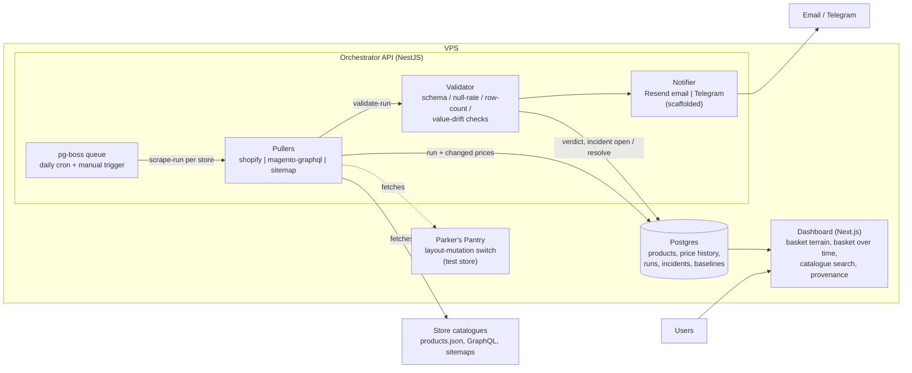
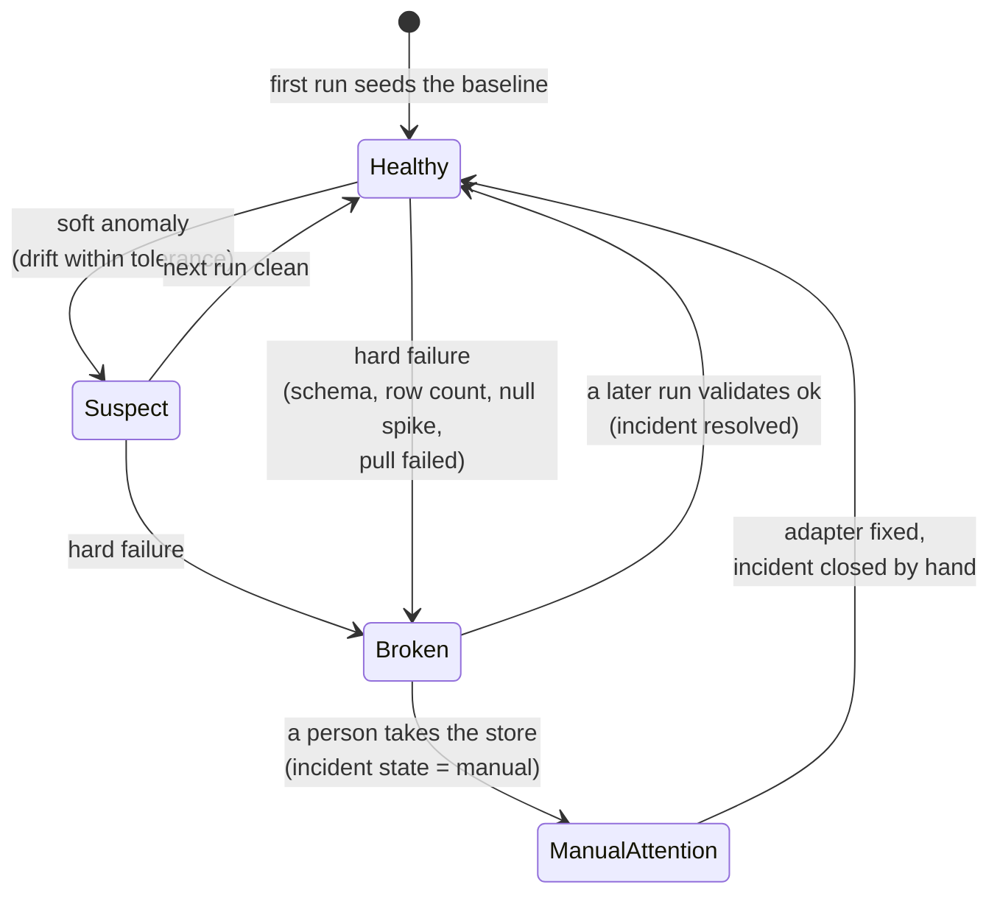
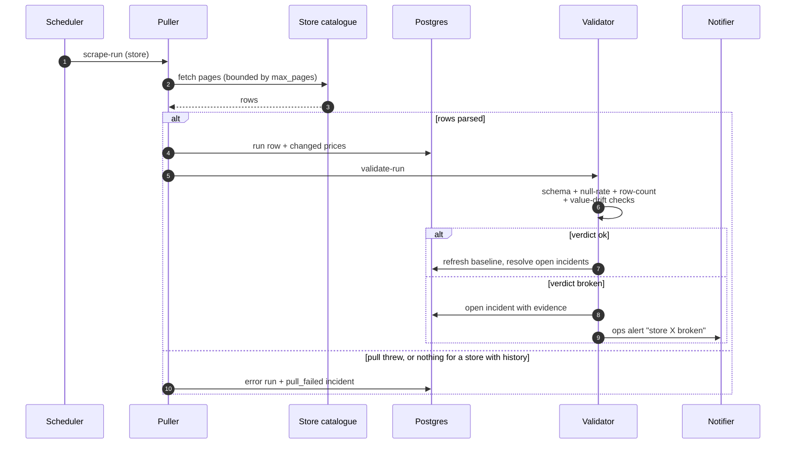
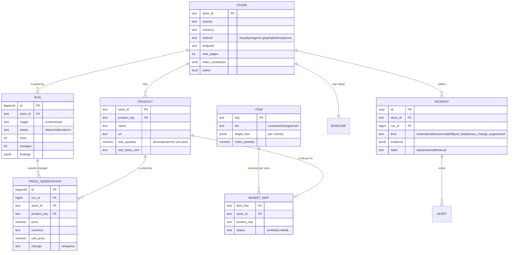
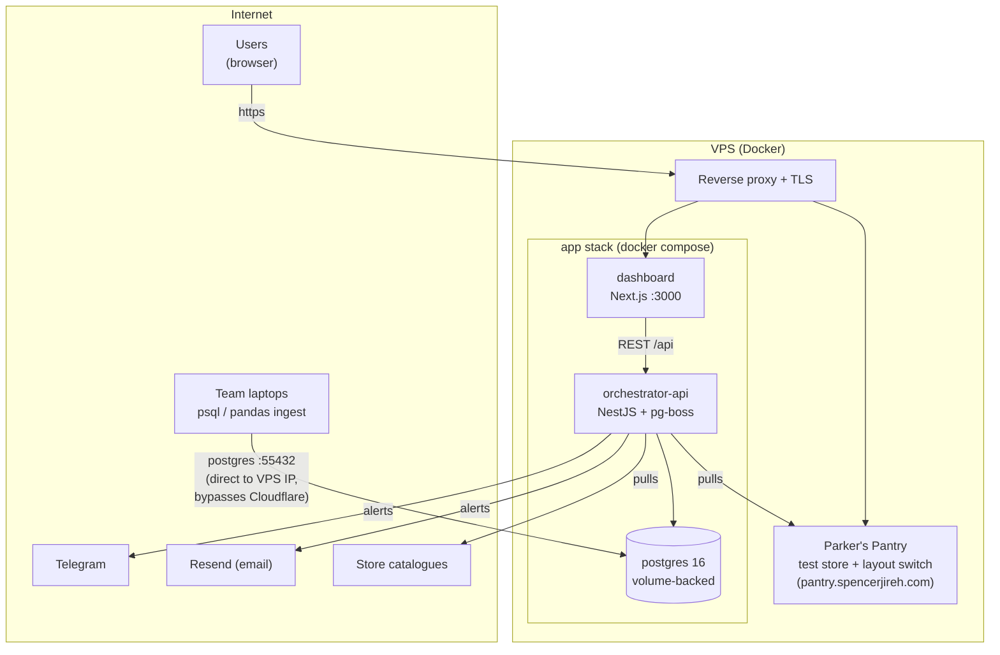

# HLD: Basketwatch

A grocery basket index for the Philippines. v2 describes the system as built
after the collection layer moved in-house: the pullers read store catalogues
directly, the validator opens incidents, and nothing repairs an adapter on
its own.

Companion: [api-contract](api-contract.md) (endpoint and response shapes).

## 1. One-liner

Shelf prices read straight from supermarket catalogues, a fifteen-staple
basket priced in every store at the same quantities, and a validator that
says so when a store's pull stops making sense, so the index shows a gap
rather than a guess.

## 2. Goals / non-goals

Goals
- A fleet of direct pullers over structurally different store platforms
  (Shopify, Magento, sitemap + JSON-LD), plus one self-hosted test store
  that can be broken on purpose.
- Detect breakage from the output: schema, null rates, row count, price
  drift, mass change. Open an incident with evidence; resolve it when the
  store comes back.
- Public dashboard: the basket terrain, the basket over time with gaps
  where data is missing, per-staple store comparison, catalogue search,
  provenance.
- Alerts: price drops (product) and breakage/recovery (ops) via Resend
  email + Telegram. Scaffolded, not yet wired.
- Deployed live on a VPS behind a public URL.

Non-goals (explicitly out)
- User accounts / auth of any kind.
- Automatic repair of a broken adapter. An incident names what to look at;
  a person fixes the adapter.
- A second country. The dimension stays in the data (`country` on every
  store-, product- and basket-shaped payload) but the contract lists PH
  alone.
- Scraping anything login-walled, paywalled, or private (house rule).

## 3. Component overview

### 3.1 Pullers
One adapter per store platform, chosen by `stores.method`; the store row
also carries `endpoint` and `max_pages`, so adding a store is a row edit.

- `shopify` pages through `/products.json`, 250 products per call, keyed by
  the numeric product id.
- `magento-graphql` reads the category tree, then pages each category.
- `sitemap` reads the sitemap (nested sitemaps to a bounded depth), ranks
  the URLs that look like product pages, fetches each and reads the JSON-LD
  `Product` block (microdata and Open Graph as fallbacks).

All three share one `Fetcher`: plain `fetch` with browser headers, a
30-second timeout and a 32 MB body cap; a failed request answers with status
0 and the adapter treats it like any other non-200. Every adapter checks
`max_pages` before each fetch, so a runaway crawl is impossible by
construction.

A run dedupes the rows, diffs them against the store's last known prices
(`latest_price`) and writes only the changes. Over 90% of an established
catalogue changing at once is recorded as a run and an incident but not
applied: a product-key scheme change is far more likely than a repricing of
everything. A pull that throws, or that returns nothing for a store with
history, records an `error` run and opens a `pull_failed` incident without
going through the validator; there are no rows to judge.

Stores with `method = 'none'` are registered but never pulled. Landers
(browser-rendered) and MerryMart (no machine-readable feed) sit there until
an adapter exists.

### 3.2 Orchestrator API (NestJS)
Single NestJS service, one directory per domain under `src/modules/`. Only
`*.repository.ts` files touch the Drizzle schema; a lint rule enforces it.

- **Jobs**: pg-boss, a Postgres-backed queue (no Redis broker): persistent
  jobs, retries with backoff, cron schedules. Queues: `fleet-pull` (the
  daily fan-out, disarmed by default), `scrape-run` (one per store, N
  workers), `validate-run` (enqueued by every applied run), `notify`.
- **Validator** (pure functions in `checks.ts`, unit-tested):
  1. Schema parse rate against the stored product shape (hard fail)
  2. Row count vs the baseline expected count (hard fail if far below)
  3. Field null-rate spike vs the rolling baseline
  4. Value drift: per-field p5/p95 envelope; soft
  - Soft anomaly -> `suspect`; hard -> `broken` + incident. One open
    incident per store at a time; an `ok` verdict on a later run resolves
    whatever was open. A healthy run also refreshes the baseline.

- **Notifier**: one interface, adapters for Resend and Telegram. Product
  alerts (price drop on a basket item) and ops alerts (breakage, recovery).
  Nothing enqueues onto `notify` yet.

### 3.3 Datastore (Postgres 16)
Tables: `stores`, `products`, `runs`, `price_observations` (+ the
`latest_price` view), `items`, `basket_map`, `baselines`, `incidents`,
`alerts`.

History is change-only: an observation lands when a price first appears or
moves, never on every run, and `runs.rows` is what tells a truncated pull
from a day of stable prices. Incident evidence is stored in full so a verdict
can be replayed against rules that did not exist when it opened.

### 3.4 Dashboard (Next.js App Router + Tailwind)
- **Basket** (`/`): the price terrain (staples x stores, height = multiple
  of the cheapest shelf), the cheapest cart, each staple's store-by-store
  rail, and the basket over time with hatched gaps on days that could not be
  fully priced, labelled with the incident that caused them.
- **Prices** (`/prices`): catalogue search with unit-price sorting.
- **Behind the data** (`/behind`): store count and last-pull provenance, and
  the pins we do not fully trust.
- Server components fetch on first paint. No component library. The
  dashboard is a **pure client of the API** and never touches Postgres; a
  lint rule makes that structural rather than aspirational.

### 3.5 Parker's Pantry (the test store)
`apps/pantry` at `pantry.spencerjireh.com/ph` -- a fictional ten-product
storefront. Prices are deterministic seeded walks from fixed base prices, and
the store ships with `index_contributor = false`, so it renders on the
dashboard but never moves the index. Purpose: a scripted, reproducible
break-and-recover case for the validator.

Layout A serves `/ph/sitemap.xml` and a JSON-LD `Product` on every product
page, so the `sitemap` adapter reads it like any other store. Layout B drops
the structured data, and the next pull returns zero rows and opens an
incident. `just pantry-layout ph b` / `ph a` flip it, guarded by
`PANTRY_ADMIN_TOKEN`.

### 3.6 Deployment
A VPS. **`docker-compose.prod.yml` at the repo root is the deployment
unit** — the deploy platform runs the stack as one Docker Compose resource
watching `main`, and redeploys on every push. `docker-compose.dev.yml`, also
at the root, runs just postgres locally; apps run on the host with hot
reload. The platform's reverse proxy handles TLS/subdomains. Secrets (ops
token, Resend, Telegram token, pantry admin token) via deploy-time env vars.

Domains: `basketwatch.spencerjireh.com` serves the dashboard, and the API sits
behind it same-origin at `/api/`. The API sets a global `api` prefix with no
exclusions and the Next.js server rewrites `/api/:path*` through **without
stripping**, so the path is identical from browser to container and the API
needs no host of its own.

Two consequences of replacing nginx with the Next server: the web container
listens on **3000**, not 80, and `API_INTERNAL_URL` is a **build argument** --
Next evaluates `rewrites()` during `next build` and bakes the result into its
routes manifest, so setting it at runtime does nothing.

Postgres is the exception to "internal-only": it is published on host port
`55432` so the team can write scraped data into it directly from their
laptops. Password auth is scram-sha-256 and the password lives only in the
deploy env. Clients connect to the VPS IP rather than a hostname — the
`*.spencerjireh.com` wildcard is Cloudflare-proxied and the proxy forwards HTTP
only, not arbitrary TCP. Postgres also listens on `55432` *inside* the
container, to clear a `DOCKER-USER` rule on the VPS that drops external traffic
to container port 5432; so on the compose network the database is
`postgres:55432`, not `postgres:5432`.

All four services -- `postgres`, `api`, `web`, `pantry` -- build and start on
every deploy. The API applies pending migrations itself on boot, ahead of the
queue and the first request.

## 4. External interfaces

| Interface | Direction | Notes |
|---|---|---|
| Store catalogues (`/products.json`, GraphQL, sitemaps + product pages) | out | plain HTTP, bounded by `max_pages` |
| Resend / Telegram | out | notifier adapters (scaffolded) |
| Public REST `/api/*` | in | dashboard reads; mutation endpoints behind the ops token and a 5/minute limit |
