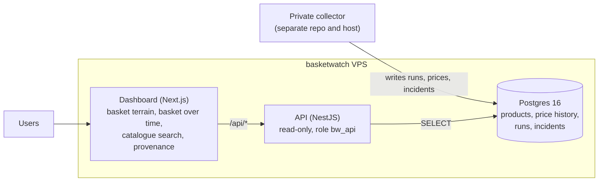
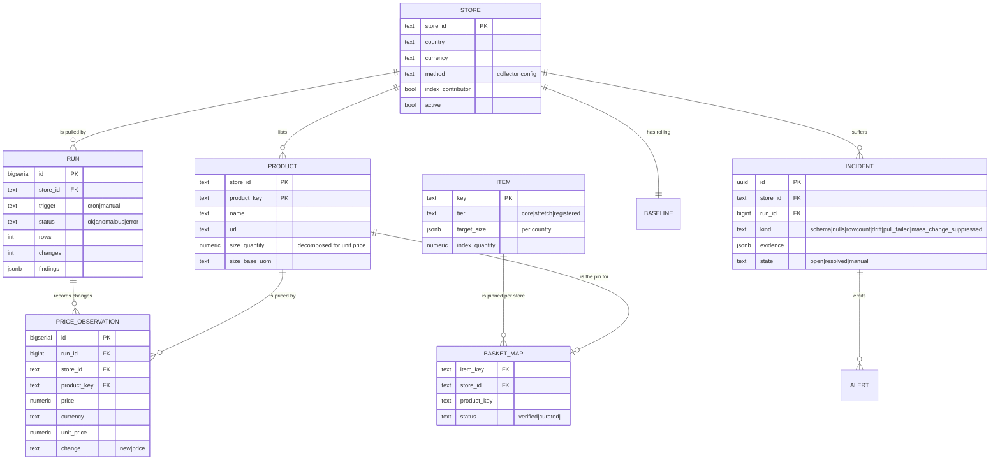

# HLD: Basketwatch

A grocery basket index for the Philippines. v3 describes the read side as it
stands after collection moved to a separate private service: this repo holds
the schema, a read-only API and the dashboard.

Companion: [api-contract](api-contract.md) (endpoint and response shapes).

## 1. One-liner

A fifteen-staple basket priced in every store at the same quantities, over
shelf prices collected daily, with a gap shown wherever a store's data could
not be trusted rather than a guess.

## 2. Goals / non-goals

Goals
- Public dashboard: the basket terrain, the basket over time with gaps where
  data is missing, per-staple store comparison, catalogue search, provenance.
- A read-only API over one Postgres database, typed end to end by
  `packages/contract`.
- Deployed live on a VPS behind a public URL.

Non-goals (explicitly out)
- User accounts / auth of any kind.
- Any write path in this repo. Runs, price observations, incidents and
  baselines are written by the private collector.
- A second country. The dimension stays in the data (`country` on every
  store-, product- and basket-shaped payload) but the contract lists PH
  alone.

## 3. Component overview

```mermaid
flowchart LR
    subgraph VPS["basketwatch VPS"]
        DB[("Postgres 16<br/>products, price history,<br/>runs, incidents")]
        API["API (NestJS)<br/>read-only, role bw_api"]
        DASH["Dashboard (Next.js)<br/>basket terrain, basket over time,<br/>catalogue search, provenance"]
    end
    COLLECTOR["Private collector<br/>(separate repo and host)"]
    USERS["Users"]

    COLLECTOR -->|writes runs, prices, incidents| DB
    API -->|SELECT| DB
    DASH -->|/api/*| API
    USERS --> DASH
```

### 3.1 API (NestJS)
Single NestJS service, one directory per domain under `src/modules/`:
`basket` (the index, today, the rails), `products` (catalogue search),
`fleet` (store state), `feed` (what happened, including SSE), `incidents`,
`health`. Only `*.repository.ts` files touch the Drizzle schema; a lint rule
enforces it.

The API serves requests as `bw_api`, a role with `SELECT` only. On boot it
applies pending migrations on a short-lived connection as the owner role
(`MIGRATION_DATABASE_URL`), then serves. There is no job queue and no write
endpoint.

### 3.2 Datastore (Postgres 16)
Tables: `stores`, `products`, `runs`, `price_observations` (+ the
`latest_price` view), `items`, `basket_map`, `baselines`, `incidents`,
`alerts`. The schema is owned here: `apps/api/drizzle`, starting from
`0000_baseline`.

```mermaid
erDiagram
    STORE ||--o{ PRODUCT : "lists"
    STORE ||--o{ RUN : "is pulled by"
    STORE ||--o{ INCIDENT : "suffers"
    STORE ||--|| BASELINE : "has rolling"
    RUN ||--o{ PRICE_OBSERVATION : "records changes"
    PRODUCT ||--o{ PRICE_OBSERVATION : "is priced by"
    ITEM ||--o{ BASKET_MAP : "is pinned per store"
    PRODUCT ||--o| BASKET_MAP : "is the pin for"
    INCIDENT ||--o{ ALERT : "emits"

    STORE {
        text store_id PK
        text country
        text currency
        text method "collector config"
        bool index_contributor
        bool active
    }
    PRODUCT {
        text store_id PK
        text product_key PK
        text name
        text url
        numeric size_quantity "decomposed for unit price"
        text size_base_uom
    }
    RUN {
        bigserial id PK
        text store_id FK
        text trigger "cron|manual"
        text status "ok|anomalous|error"
        int rows
        int changes
        jsonb findings
    }
    PRICE_OBSERVATION {
        bigserial id PK
        bigint run_id FK
        text store_id FK
        text product_key FK
        numeric price
        text currency
        numeric unit_price
        text change "new|price"
    }
    ITEM {
        text key PK
        text tier "core|stretch|registered"
        jsonb target_size "per country"
        numeric index_quantity
    }
    BASKET_MAP {
        text item_key FK
        text store_id FK
        text product_key
        text status "verified|curated|..."
    }
    INCIDENT {
        uuid id PK
        text store_id FK
        bigint run_id FK
        text kind "schema|nulls|rowcount|drift|pull_failed|mass_change_suppressed"
        jsonb evidence
        text state "open|resolved|manual"
    }
```

History is change-only: an observation lands when a price first appears or
moves, never on every run, and `runs.rows` is what tells a truncated pull
from a day of stable prices. Incident evidence is stored in full so a verdict
can be replayed later. Days with an open incident on an index store render as
hatched gaps on the chart.

### 3.3 Dashboard (Next.js App Router + Tailwind)
- **Basket** (`/`): the price terrain (staples x stores, height = multiple
  of the cheapest shelf), the cheapest cart, each staple's store-by-store
  rail, and the basket over time with hatched gaps on days that could not be
  fully priced, labelled with the incident that caused them.
- **Prices** (`/prices`): catalogue search with unit-price sorting.
- **This week** (`/this-week`): government series (DOE pump prices and
  adjustments, LPG, DA wet-market prices, DTI SRPs) from `gov_series` and
  `gov_prices`, via `/api/gov/*`.
- **Behind the data** (`/behind`): store count and last-pull provenance, and
  the pins we do not fully trust.
- Server components fetch on first paint. No component library. The
  dashboard is a **pure client of the API** and never touches Postgres; a
  lint rule makes that structural rather than aspirational.

### 3.4 Deployment
A VPS. **`docker-compose.prod.yml` at the repo root is the deployment
unit** -- the deploy platform runs it as one Docker Compose resource watching
`main` and redeploys on every push. `docker-compose.dev.yml` runs just
postgres locally; apps run on the host with hot reload.

Domains: `basketwatch.spencerjireh.com` serves the dashboard, and the API sits
behind it same-origin at `/api/`. The API sets a global `api` prefix with no
exclusions and the Next.js server rewrites `/api/:path*` through **without
stripping**, so the path is identical from browser to container.

The web container listens on **3000**, and `API_INTERNAL_URL` is a **build
argument**: Next evaluates `rewrites()` during `next build`.

Postgres is published on port `55432` for the collector. A `DOCKER-USER`
rule on the VPS drops every source but the collector's host and the Docker
networks; backups run over SSH inside the container.
Password auth is scram-sha-256. Clients connect to the VPS IP rather than a
hostname -- the `*.spencerjireh.com` wildcard is Cloudflare-proxied and the
proxy forwards HTTP only. Postgres also listens on `55432` *inside* the
container, to clear a `DOCKER-USER` rule on the VPS that drops external
traffic to container port 5432; on the compose network the database is
`postgres:55432`.

## 4. External interfaces

| Interface | Direction | Notes |
|---|---|---|
| Public REST `/api/*` | in | dashboard reads only |
| Postgres `:55432` | in | the private collector's writes (its host only) |
