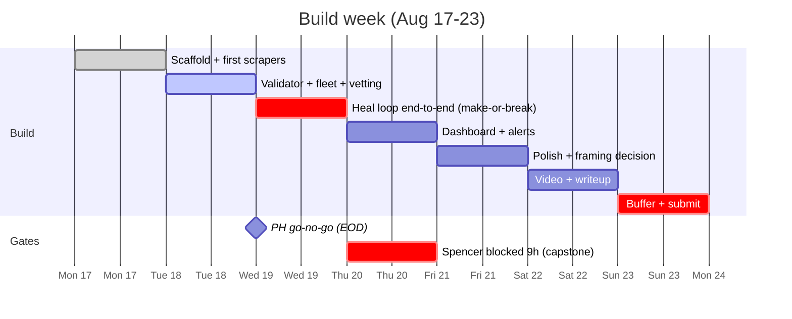

# Into the Scrape-Verse — Hackathon Brief

Source: https://www.wemakedevs.org/hackathons/scrape-verse
Dates: August 17-23, 2026 (online or SF). Team: solo or up to 4.
Organizer: WeMakeDevs. Title sponsor: Bright Data.
Companions: [architecture](architecture.md), [prd](prd.md).

## Week at a glance

## Core challenge

Build web scrapers that repair themselves when websites change layout,
then use that data to build something meaningful.

**Bright Data Scraper Studio is mandatory** and must be central to the project.

## Tracks (every submission auto-considered for the first three)

| Track | Criterion | Prize |
|---|---|---|
| Web-Slinger (grand) | Best use of Bright Data: scraper design, coding agent integration, self-healing, structured output | NVIDIA DGX Spark ($5k) or $5k cash |
| Suit-Up | Best UI: looks/feels finished, data presentation | iPad per member |
| Spider-Sense | Best clean code: readable, structured, edge cases handled | Keychron per member |
| Daily Bugle | Best LinkedIn post: build-in-public documentation, tag Kunal + Bright Data | Samsung Galaxy Watch (~$600) |

Also given away: an Iron Man helmet (criteria unstated). The clean-code track
is sponsored by Kodo.

## Judging criteria (equal weight)

1. Potential impact — solves a clear, useful problem
2. Creativity and innovation — original approach to web-data collection
3. Technical excellence — complete, reliable, well-structured
4. Use of Scraper Studio — central to the project
5. Reliability and self-healing — handles site changes and extraction failures
6. Presentation — clearly explains problem, workflow, output, product

## Rules

- Public web data only; no login-protected, paywalled, or private data
- AI coding tools allowed; must understand and verify the code

## Submission

GitHub repo + demo video + project description + explanation of Scraper Studio usage + form.

## Scraper Studio facts (from docs/research; corrected by the findings below)

- AI-powered scraper builder: give a URL + description of data, it generates
  and deploys a working scraper (JavaScript, editable in a web IDE).
- Self-Healing tool: plain-language prompt -> AI proposes a code diff ->
  review/accept -> preview -> save to production. Drivable three ways: the
  control-panel UI, the CLI (`scraper heal`, plus `--auto-approve
  --auto-save` for unattended runs), and REST (`refactor_template` ->
  `resume_automation_job`). Refactor can take up to 15 min. Works on scrapers
  saved in development mode. Prompt-level flow, with expected output at each
  step: [agent prompts](reference/brightdata-agent-prompts.md).
- Free tier: 5,000 credits/month. Promo code `wemakedevs` = +$50 credits.
- Bright Data also ships an official CLI (github.com/brightdata/cli) that
  drives the whole Studio loop from the terminal — create, run, heal, approve
  — alongside scrape/search/extract, `brightdata skill`, and
  `brightdata add mcp`. Installed as both `brightdata` and `bdata`; Bright
  Data's own docs invoke it via `npx -p @brightdata/cli` with
  `bdata login --device`, which is the login that works inside a coding
  agent or SSH session.

## Experiment findings (Aug 15)

- [x] CLI (`@brightdata/cli` v0.3.4) covers the whole loop: `scraper create`,
  `scraper run`, `scraper heal` (with `--auto-approve --auto-save` = fully
  autonomous healing), `scraper approve`. Healing is NOT UI-only.
- [x] Underlying REST endpoints (api.brightdata.com): `/dca/collector` (create
  template), `/dca/collectors/<id>/automate_template` (AI generate),
  `refactor_template` (heal), `resume_automation_job` (approve/resume),
  `/dca/trigger`, `/dca/trigger_immediate`, `/dca/crawl` (sync), `/dca/get_result`.
  Watchdog backend can call these directly, no CLI shell-out needed.
- [x] `scraper run <id> <url> --sync` works end-to-end: returned clean JSON
  from a saved scraper. Execution engine is NOT gated.
- [x] Scrapers can deliver via webhook (`--deliver-webhook`) — event-driven design possible.
- [x] `brightdata add mcp` installs Bright Data MCP into Claude Code/Cursor;
  `brightdata skill` manages agent skills. Ammo for "coding agent integration".
- [x] Test runs cost ~nothing: balance still $50.00 after several preview/sync runs.

## Day-1 findings (Aug 17)

- Verification UNBLOCKED (Bhaskar from Bright Data cleared it after email).
- Full loop proven end-to-end on collector c_msxak9lb21yj6b9tf9 (HN test):
  - AI create: ~6.5 min, pipeline steps visible during polling (intent ->
    schema -> codegen -> preview) — dashboard can show these live.
  - First AI-generated scraper shipped silently half-broken: ~85% of rows
    empty, no error raised. Perfect narrative + validator justification.
  - `scraper heal --auto-approve --auto-save` fixed it autonomously:
    0% empty rows after, 93% fully populated (7% partial = HN job posts
    with no points/author — legitimately missing).
- Cost of everything so far: $0.24 (balance $49.76). Credits are a non-issue
  if scrapers stay bounded.
- LESSON: creation descriptions must bound crawl scope explicitly — "top 30
  stories" crawled ~150 pages (4,470 rows) because it didn't say stop.
  Price scrapers target fixed product URLs. Add row-count ceiling check.
- New 4th track announced: "Daily Bugle" — best LinkedIn documentation
  (Galaxy Watch). Post build-in-public updates during the week.
- Organizer tip: target niche sites lacking pre-built scrapers (avoid
  Amazon/Walmart — 800+ prebuilt exist). Regional grocers/pharmacies it is.
- Schedule: user has 9h work block Thu Aug 20 ("AI Bootcamp Capstone") —
  polish work may need to shift Wed evening / Fri morning.

## CLI and cost findings (Aug 20)

Full writeup in [credit monitoring](credit-monitoring.md); the headlines,
all tested against CLI 0.3.5:

- **Studio runs against listing pages spent $26.54 against a $5 ceiling** on
  Spencer's account, roughly half of it, before the evidence settled that
  Studio should not be pointed at stores that publish a free bulk endpoint.
  Cost is wildly non-uniform: a product-page run costs cents, that
  listing-page run cost about $2.19, and the whole 433-call vetting sweep
  cost $0.52.
- `budget balance` is useless for monitoring — it rounds to the dollar and
  did not move across six Unlocker calls. `budget zones` reports cost to
  the cent plus bandwidth per zone, and is what our guard reads.
- Usage lags by minutes, so a single action usually reports $0.00 and its
  cost lands attributed to whatever runs next. Bandwidth moves first, which
  makes megabytes the early warning for an unbounded crawl.
- Web Unlocker does not execute JavaScript in any output format. `--format
  markdown` on a React storefront returned only the page title. It answers
  "am I blocked or geo-gated", never "does this page have prices".
- `brightdata browser` is a separate tier: a real browser, geo-targetable
  with `--country`, billed by bandwidth on the `cli_browser` zone. It is
  the only way to see what a US shopper sees on a JS-heavy site, since
  local Playwright renders but from a PH IP.
- Every spending command now runs through a guard: `studio.py`'s `Guard` on
  the Python side, `scripts/bd.mjs` on the Node side. Both check before the
  call and re-read the meter after it, including after a timeout — killing
  the CLI does not stop a collection that is already billing server-side.

## Kickoff webinar findings (Aug 18)

Source: the official WeMakeDevs kickoff stream (54m), recorded locally via OBS.
Transcript sits in the session scratchpad (`stream.txt` / `stream.vtt`), not
committed. Timestamps below index into that recording.

- Anil from Bright Data is both a judge and the author of the repo vendored
  into [agent prompts](reference/brightdata-agent-prompts.md) — that file is the
  literal script for his live demo. He is a technical product marketer and
  leads go-to-market for Scraper Studio and the Scraper APIs.
- **Healing during the event is NOT a requirement** (47:43), asked directly how
  anyone demos a heal when sites do not redesign themselves in a week: "It
  doesn't mean the website has to break during the event. That's not the
  mandatory requirement. The mandatory requirement is using the Scraper Studio
  to build something cool. If the website doesn't change during the week,
  that's fine. That's not a requirement. It's just the outcome." Consequences
  for our cut order are open item C5 in [prd](prd.md).
- Judge's stated priority order when asked what he looks for (33:32): did you
  use Scraper Studio (first and foremost) -> is it demoable, can he check it ->
  is the use case real -> clean readable code -> demo narrative (what the
  challenge was, how Studio solved it, what the end result is).
- A two-version sample store with a switch between layouts is his recommended
  way to stage a heal demo (46:42) — independent confirmation of the Parker's
  Pantry approach.
- Bright Data MCP is optional but scores (36:00): "You don't have to use the
  Bright Data MCP, but you can, extra points for you to go the extra mile."
- Scraper Studio exposes **functions** — click, navigate, wait, input (45:16).
  "It's basically a browser sitting on the cloud and you're just giving
  instruction to browser what to do." This is the lever for store/ZIP gating on
  grocery sites; see 3.1 in [architecture](architecture.md).
- Auto self-healing — no prompt needed, "zero maintenance" — is on Bright
  Data's product roadmap (24:26). Frame our orchestrator as building that loop
  today rather than as permanently novel.
- Submissions open Aug 19, early filing is encouraged for feedback, and the
  form stays editable after you submit (36:20).
- Mid-event feedback stream Thursday Aug 20 (34:48): show progress, get live
  feedback from Kunal and Anil. Collides with the 9h capstone block.
- Q&A gotcha: a participant's heal silently did nothing because the scraper was
  never saved to production and stayed on the dev version. The approve ->
  update schema -> save-to-production sequence no-ops if you stop partway.
- Field size: ~8,500 registrations.

## RESOLVED BLOCKER (was: as of Aug 15)

- All AI features (AI create `automate_template`, AI chat, presumably heal)
  return 403 "Automation not allowed" — account-level gate, both API and UI,
  until account verification is approved. Verification form submitted (twice),
  pending review. If not approved by Aug 16, email contact@wemakedevs.org and
  file a Bright Data ticket (brightdata.zendesk.com).
- Fallback if verification drags: hand-write scraper code in the Studio IDE
  (works fine) and drive run/heal-approve via API once unlocked.
- Cleanup: delete orphaned draft collectors c_mst98nji1s5i7hpd23,
  c_msta47n824rz4ktiko, c_mstoeqqqhoymxwrma (c_mstog9q62pf1hput7t kept as the
  saved smoke-test scraper).
