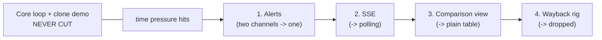

# PRD: Basketwatch

v1 — confirmed Aug 18, 2026. Scope below is unchanged; the notes marked
**Status Aug 20** record what has actually happened against it.

Two things moved since v1 was written, both of which affect the plan rather
than the scope:

- **The PH gate passed** (Aug 19). Nine PH sites vet fleet-ready against a bar
  of two, so PH is in and the US-vs-PH comparison view is unblocked. Evidence:
  `lab/spencer-exploration/registry.json`.
- **The app was rebuilt** (Aug 20). `scrape-verse/` became `basketwatch/` on
  pnpm + Turborepo, NestJS + Next.js. **The clone store was deleted in that
  rebuild** and has not been replaced, which puts a dependency under decision 5
  and the definition of done — see the note on each.

Companions: [architecture](architecture.md) (HLD),
[hackathon-brief](hackathon-brief.md) (rules + findings).
Review artifact: https://claude.ai/code/artifact/f7cf34cf-af6e-4efd-8f76-16dd1865ef36

## 1. Product statement

A daily grocery basket price tracker across real store sites, built on a
fleet of Bright Data Scraper Studio scrapers. The differentiating promise is
reliability made visible — "the basket index that never lies": a
spider-sense layer validates every delivered run (schema, null-rates, row
counts, value drift, freshness), opens incidents with evidence when data
goes silently wrong, and an autonomous heal loop repairs the scraper through
Studio, verified by canary run, every step audited.

**Primary user: judges wearing both hats.** The consumer view (basket chart,
store comparison) must feel finished; the ops view (fleet health, incident
evidence, heal diffs) carries the engineering depth. When tradeoffs arise,
judging value decides.

## 2. Decisions (locked in team interview, Aug 18)

1. **Coverage**: US fleet is committed scope. PH sites join only if >= 2 vet
   cleanly by end of Aug 19; otherwise ship US-only with zero rework.

   > **Status Aug 19: gate PASSED.** Nine PH sites vet fleet-ready, against a
   > bar of two, so the left branch below is the one that happened.
   > `ph-smmarkets` is the strongest: a public Magento GraphQL endpoint
   > returning live PHP prices.

   ```mermaid
   flowchart LR
       VET["Vet 6 PH candidate sites<br/>(cheap HTTP checks first)"] --> GATE{">= 2 scrape<br/>cleanly by<br/>Aug 19 EOD?"}
       GATE -->|yes| IN["PH fleet joins<br/>+ US-vs-PH comparison view"]
       GATE -->|no| OUT["Ship US-only<br/>(zero rework;<br/>country model stays)"]
   ```
2. **Multi-country is architectural, not a feature**: country is a
   first-class dimension on stores, products, and baskets, with generalized
   currency handling. Adding any country's sites later immediately enables
   comparison; US-vs-PH is just the first instance.
3. **Headline story**: reliability-first ("the basket index that never
   lies"); the cross-country comparison is a feature, not the headline.
4. **All four extras are P0** (comparison view, Wayback replay rig, SSE live
   dashboard, Telegram + email alerts) with the cut order in section 4.
5. **Proof-of-healing bar**: the scripted clone-store break-and-heal is the
   required demo centerpiece. The pre-build HN heal is excluded from demo
   material. Organic incidents and Wayback replay are bonus evidence layers.

   > **Status Aug 20, team decision (closes C7):** unchanged as a decision, and
   > explicitly **last in build order**. The clone store stays the required demo
   > centrepiece and is not cut — but it is a prop, and a prop cannot be
   > demonstrated until the engine that breaks and heals it exists. It is
   > therefore built after the read path, ingest and the heal loop, not before.
   >
   > Note what this means if time runs out: the thing scheduled last is the
   > thing most exposed to the deadline, and it is also the one the demo is
   > built around. C6 is the release valve — the Aug 18 kickoff established
   > that a live heal is not a hackathon requirement, only Studio use is — so
   > if the engine lands late, the proof falls back to organic incidents and
   > the recorded pre-build heal, and the demo video is cut accordingly.
6. **US site selection**: mixed, authenticity-weighted — 2-3 real
   grocer/pharmacy sites plus easy online pantries, swapping toward
   authentic sites as they prove workable.

## 3. Scope

### Core (P0, never cut)
- Fleet of 4+ US scrapers plus the clone store, uniform output contract,
  scheduled 2x daily. (Clone store pending rebuild — see decision 5.)
- Spider-sense validator opening incidents with evidence bundles.
- Autonomous heal loop: evidence -> Claude-composed prompt ->
  refactor_template -> auto-approve -> canary verify -> save or escalate;
  budget guard on every Studio call.
- Dashboard: basket index chart (gaps + heal markers), fleet board, basket
  table, engine activity feed.

  > **Status Aug 20:** rebuilt in Next.js and running on fixtures typed by the
  > API contract, so the swap to live endpoints changes no types. The index
  > chart renders outages as a hatched span labelled with the incident, and the
  > heal that closed it as a marker on the line — the gap is drawn, never
  > interpolated across.
- Full audit trail persisted; deployed live on the Coolify VPS.

### Extras (P0 by decision)
| Feature | Status | Notes |
|---|---|---|
| US-vs-PH comparison view | gated on PH sites | country-dimensioned data model ships regardless |
| Wayback drift-replay rig | feasibility test first | scraper built on archived page, run on today's |
| SSE live dashboard | P0 | runs and heals stream into the UI live |
| Alerts: Telegram + Resend email | P0, first cut | notifier interface stays regardless |

### Non-goals
- No auth or user accounts; no login/paywalled scraping; no human approval
  gates in the heal loop; no mobile app.
- HN born-broken heal story does not appear in the demo.

## 4. Cut order under time pressure

1. **Alerts** — ship one channel instead of two; interface stays.
2. **SSE** — fall back to auto-refresh polling.
3. **Comparison view** — ships as a plain table; country data model untouched.
4. **Wayback rig** — drop; clone store + any organic incident carry the proof.

The core loop and the clone-store demo are never cut.

**Cut order is not build order.** The clone store is never cut and is built
*last* (decision 5): it is a prop for the engine, so it cannot be shown until
the engine runs. Nothing else in this list is sequenced by its position here.



## 5. The basket

Canonical items with per-store, per-country product mappings.

- **US**: eggs (dozen), whole milk (1 gal), white bread, rice (5 lb), ground
  coffee (12 oz), sugar (4 lb), chicken breast (per lb), cooking oil
  (48 oz), pasta (1 lb), bananas (per lb).
- **PH (if gated in)**: same categories localized — rice per kg as the
  anchor item, eggs per tray where sold, cooking oil 1L, instant coffee
  sachets. The comparison view normalizes per-unit where possible and
  discloses where it cannot.

## 6. Candidate sites to vet (Aug 18-19)

Vetting bar: public product pages, stable URLs, prices reachable by Studio,
absent from Bright Data's 800+ prebuilt scrapers, structurally diverse.
Cheap HTTP checks first; Studio credits only on survivors.

- **US (need 4+ survivors)**: FreshDirect, Weee! (authenticity anchors);
  Rite Aid (pharmacy); Vitacost, iHerb, Swanson (online pantries); H-E-B
  (try last, app-first risk).
- **PH (gate: 2+ survivors by Aug 19 EOD)**: Watsons PH, Southstar Drug
  (best odds); Landers, WalterMart Delivery (mid risk); PureGo, MerryMart
  (app-first risk).
- **Always in fleet**: Parker's Pantry (clone store on VPS subdomain) —
  disclosed test rig with layout-mutation switch.

## 7. Definition of done (Sat Aug 23)

- 5+ scrapers live with 4+ days of real price history charted.
- Clone-store break -> detect -> heal -> verify reproducible end-to-end,
  and runnable by a judge from the repo README.
- Dashboard deployed on a public URL with zero mock data.
- Demo video <= 3 min: problem, live product, the heal moment, audit trail,
  architecture beat.
- Submission filed: repo + video + description + Studio-usage writeup.

> **Status Aug 20.** Against each line:
>
> | Item | Where it stands |
> |---|---|
> | 5+ scrapers, 4+ days of history | **Met, accidentally.** 19 scrapers, and four days of observations (Aug 19-22) charted as five points. Aug 21 and 22 arrived from the catalogue schedule, which was armed the whole time by a boolean-coercion bug — `z.coerce.boolean()` reads `"false"` as `true`, and prod compose always passes a non-empty string. 32 runs, 54,918 rows, 369 recorded price movements. The one item no later effort could have recovered was being quietly banked while the docs said it was not. |
> | Clone-store break-and-heal | **Not started, and deliberately last.** The clone store was deleted in the rebuild and is scheduled after the engine works — see decision 5. |
> | Public URL, zero mock data | **Zero mock data: done.** Every dashboard route reads Postgres and `apps/web/src/fixtures/` is deleted. `api` and `web` are no longer profile-gated, so the public URL lands with the next deploy. |
> | Demo video | Not started. |
> | Submission filed | Not started; the form has been open since Aug 19. |
>
> The blocking dependency that held three of these five — an endpoint that
> reads the database — cleared on Aug 20.

## 8. Open items

- C1: basket contents approval (esp. PH localization) — team.
- ~~C2: PH gate deadline confirmed as Aug 19 EOD unless changed.~~
  **Resolved Aug 19: PASS.** Nine PH sites vet fleet-ready against a bar of
  two, so PH joins the fleet and the comparison view is unblocked. Scored
  registry: `lab/spencer-exploration/registry.json`.
- C3: site list additions/vetoes — team.
- ~~C4: real product name~~ — **settled as `basketwatch`**: the deployed
  hostname, the Postgres role and database, the monorepo directory, and (as of
  the public release) the GitHub repository `spencerjireh/basketwatch`. The
  Coolify resource was updated to match when the repo was renamed.
- C5: which Bright Data account owns the fleet. The team has two accounts
  with separate budgets, and triggers/heals cannot cross accounts, so this
  decides the orchestrator's key, the credit ceiling, and where every
  scraper is created. Needed before the fleet is built out.
- C6: the Aug 18 kickoff confirmed a live heal is NOT a hackathon
  requirement — only Scraper Studio use is (47:43, see brief). The heal
  loop is therefore a differentiator, not a gate. Decide: keep it as the
  centerpiece of the week, or demote it in the cut order. Until this is
  settled the DoD below is unchanged and still assumes centerpiece.
- ~~C7 (new, Aug 20): the clone store was deleted in the rebuild and the
  proof-of-healing bar depends on it.~~ **Resolved Aug 20: rebuild it, and
  build it last.** It remains the required demo centrepiece and is not cut;
  it is sequenced after the read path, ingest and the heal loop, because a
  chaos target is only demonstrable once there is an engine to break. See the
  note on decision 5 for what happens if the engine lands late.
